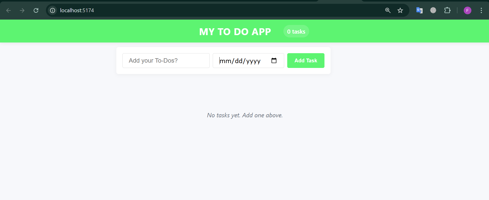
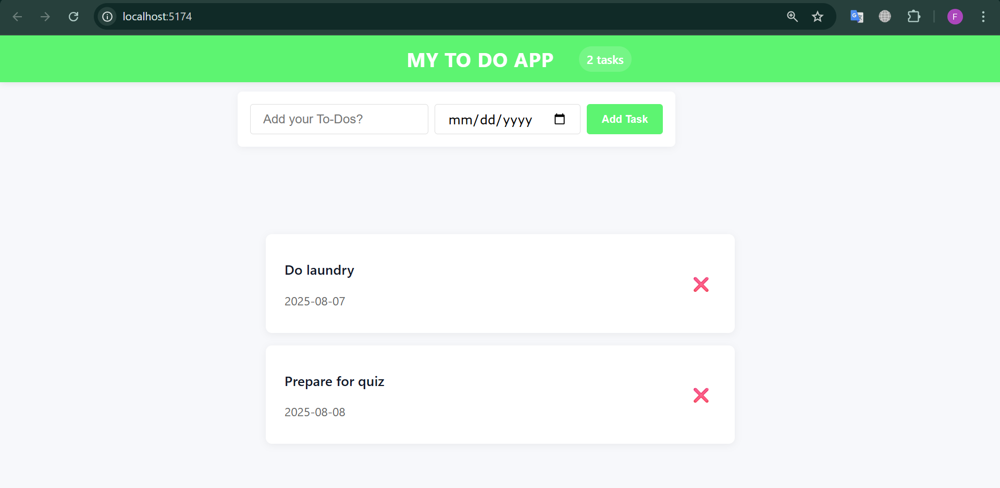

# ✅ My To Do App

A simple, elegant, To Do application built with **React**.  
You can add, view, and delete tasks — complete with due dates. Clean UI, fast interactions, and mobile-friendly.


## 🚀 Features

- 📝 Add tasks with optional due date
- 🗂️ View all tasks in card layout
- 🗑️ Delete tasks easily
- ⚛️ Built using React + CSS Modules

---

## 🖼️ Screenshots

### 🧭 Main Interface


### 🧾 Task List


---

## ⚙️ Tech Stack

- **React**
- **CSS**
- Vite (or Create React App)
- Git/GitHub

---

## 🛠️ Installation

1. **Clone the repository**
```bash
git clone https://github.com/your-username/your-repo-name.git
cd your-repo-name
npm install
npm run dev


